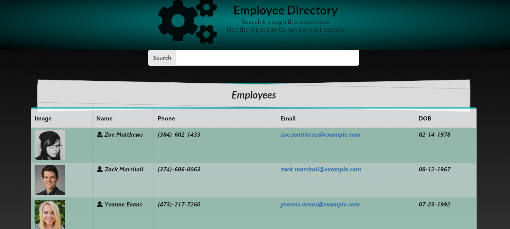

# Employee Directory - Contacts Database renderd using React

## Description

A mock employee database with simplicity for the user in a custom UI rendered using React and a mock server for the back-end. The application stores information on employees in a company with the employee's information:
- Name
- Phone
- Email
- DOB
- Image identification
This information is then rendered in a table format to visualize the contact information for each employee

## Purpose

The ***Employee Directory*** application was a small project to utilize gained knowledge, build experience, and practice web development using React.

## Table of Contents

* [Description](#description)
* [Purpose](#purpose)
* [Technologies](#technologies)
* [Usage](#usage)
* [Credits](#credits)
* [License](#license)


## Technologies:

The technologies used to create this terminal application are as follows:
- JavaScript
- React.js
- React-router-dom
- Node.js
- Node Package Manager
- GitHub
- GitBash terminal
- Google
- React-semantic-ui 

## Usage

It has three simple feature to make searching through the database easier. 
To search for a *specific person*, the search input field can be used. 
The user interface will filter out any employee that does not fit the searched criteria, and only render those that do.

---

---
The second feature this application has is to *reset* the data in **ascending** or **descending** order, based on the employee's name.
This can be done simply by clicking on the ***Name*** header of the table.

---
```
Ascending (a, b) order
```

```
Descending (b, a) order
```

---

The third simple feature is the link-like *email*. 
When the email is clicked, the browser will attempt to open an email service application on your local machine to make it easier to contact the individual by email.


[Adrian'sGithub](https://github.com/adrianromero13)


## Credits

* UC Berkeley, Extensions Full Stack Development BootCamp Instructors & Assistants
    - Manny Jucaban
    - Musa Akbari
    - Amanda Crawford

* Google inc.           **[Google](https://www.google.com)**
* NPM Registry          **[NMP](https://docs.npmjs.com/)**
* GitHub                **[GitHub](https://github.com/)**
* React documentation   **[React](https://react.semantic-ui.com/)**
    
    


## License

[GNU General Public License v3.0](./LICENSE.txt)


## Contributing


[Contributor Covenant](https://www.contributor-covenant.org/)


---
Adrian Romero 2020 React App Project Employee Directory
